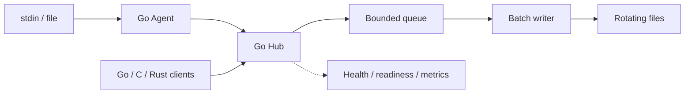

<div align="center">
  
  <h1>Aether-Log</h1>
  <h3>A small, fast distributed log aggregation engine.</h3>
  <p>Collect records over TCP. Batch writes. Keep your logs in one place.</p>
</div>

<p align="center">
  <a href="go.mod"></a>
  <a href="#limitations-and-roadmap"></a>
  <a href="docs/protocol.md"></a>
</p>

<p align="center">
  <a href="docs/protocol.md"></a>
  <a href="docs/architecture.md"></a>
  <a href="https://github.com/nihitdev/Aether-Log"></a>
</p>

<p align="center">
  <a href="#quick-start">Quick start</a> ·
  <a href="docs/architecture.md">Architecture</a> ·
  <a href="docs/protocol.md">Protocol</a> ·
  <a href="#clients">Client SDKs</a> ·
  <a href="site/README.md">Website</a>
</p>

---

A compact distributed logging experiment with a canonical Go Hub and Agent,
and small Go, C and Rust clients. The core uses standard libraries. Delivery
semantics and operational limits are documented explicitly.

## Architecture



See the [architecture guide](docs/architecture.md) and [wire specification](docs/protocol.md).

| Capability | What it does |
| --- | --- |
| Bounded ingestion | Limits connections, payloads and queue capacity; applies TCP backpressure. |
| Batched persistence | Flushes by record count or interval, with size-based rotation. |
| Graceful shutdown | Cancels readers and drains accepted queued records. |
| Agent reliability | Reconnects with capped exponential delays and cancellable timeouts. |
| Observability | Exposes health, readiness and JSON metrics. |
| Compatible clients | Go, C and Rust emit the same documented v1 frames. |

## Quick start

Requires Go 1.24+; a POSIX C compiler is needed only for the C example.
Rust/Cargo is needed only for the Rust SDK targets and example.

```sh
git clone https://github.com/nihitdev/Aether-Log.git
cd Aether-Log
make build
./bin/aether-hub -log aether.log
```

In another terminal:

```sh
printf 'first record\nsecond record\n' | ./bin/aether-agent
curl http://127.0.0.1:8081/readyz
curl http://127.0.0.1:8081/metrics
# Allow the default one-second flush interval, then inspect the log.
tail aether.log
```

## Usage

<details>
<summary><strong>Build and installation</strong></summary>

`make build` writes ignored binaries under `bin/`. Alternatively:

```sh
go install gitlab.com/nihitdev/Aether-Log/cmd/hub@latest
go install gitlab.com/nihitdev/Aether-Log/cmd/agent@latest
```

Those install the repository revision available remotely; local work is built
with `make build`. Run binaries with `-h` for all flags. No release is claimed.

</details>

<details>
<summary><strong>Hub configuration and rotation</strong></summary>

```sh
./bin/aether-hub -listen 127.0.0.1:8080 -metrics 127.0.0.1:8081 \
  -log /tmp/aether.log -queue-capacity 1024 -batch-size 128 \
  -flush-interval 1s -rotate-bytes 67108864 -retain 5 \
  -max-connections 256 -max-payload 1048576 -read-timeout 1m
```

Defaults bind TCP `:8080` and HTTP `:8081` on all interfaces. Use loopback or a
trusted network. The output parent directory must already exist. Send SIGINT or
SIGTERM for graceful shutdown. Storage errors produce failed readiness and a
nonzero shutdown exit. Archives are `aether.log.1` through `aether.log.5`.
`-rotate-bytes 0` disables rotation; `-retain 0` discards old files on rotation.

</details>

<details>
<summary><strong>Agent input and practical examples</strong></summary>

```sh
./bin/aether-agent -hub 127.0.0.1:8080 -file application.log
printf '%s\n' '{"app":"payments","message":"started"}' | ./bin/aether-agent
./bin/aether-agent -file - -retry 200ms -max-retry 10s -connect-timeout 5s
```

Input is newline-delimited, with the final unterminated line accepted. The scanner
removes line endings (including CRLF). Empty lines are records. `-max-line`
defaults to 1 MiB and supports up to 16 MiB; match the Hub payload limit.
File mode reads to EOF; it does not follow a growing file. A disconnected Agent
retries its current record until sent or cancelled. SIGINT/SIGTERM stops it.

</details>

## Observability

| Endpoint | Meaning |
|---|---|
| `/healthz` | HTTP process liveness |
| `/readyz` | 200 when ready; 503 on shutdown or persistence failure |
| `/metrics`, `/stats` | JSON snapshot |

Snapshots include accepted/rejected/active connections, received frames and
payload bytes, queued/batched/persisted/dropped records, queue depth/capacity,
successful batches, write failures, readiness and uptime. JSON is not Prometheus
text format. See [counter semantics](docs/architecture.md).

<details>
<summary><strong>Batching and backpressure</strong></summary>

The Hub writes batches rather than individual records. Batches flush at the
record count threshold or on a periodic timer, and remaining records flush on
shutdown. Rotation preserves a complete batch, so a file can exceed its size
threshold. A full queue blocks connection readers and eventually TCP senders.
Choose queue, batch, payload and connection limits together: record memory scales
with all four. The defaults are bounds, not a recommended memory budget for every
host. There is no durable queue or filesystem synchronization per batch.

</details>

## Clients

<p align="center">
  <a href="sdk/go/client.go"></a>
  <a href="sdk/c/aether.h"></a>
  <a href="sdk/rust/README.md"></a>
</p>

| SDK | API | Example |
| --- | --- | --- |
| [Go](sdk/go/client.go) | `New`, cancellable `Send`, `Close`; capped reconnect backoff | `go run ./sdk/go/example` |
| [C](sdk/c/aether.h) | POSIX `connect/send/close`; blocking sockets, no retries | `make -C sdk/c` then `sdk/c/example` |
| [Rust](sdk/rust/README.md) | Synchronous `connect/send/close`; configurable limits, no retries | `make sdk-rust` |

<details>
<summary><strong>Client details and Rust examples</strong></summary>

V1 has an 11-byte big-endian header: magic `0xAE744552`, version `1`, type `1`
(Data) or `2` (SlowDown), and a 32-bit payload length. Data contains opaque bytes.
The Hub appends a newline to each record. SlowDown is codec-supported but unused.
There are no acknowledgements or v2 changes. Read [protocol.md](docs/protocol.md)
before implementing a client.

- [Go SDK](sdk/go/client.go): `New`, cancellable `Send`, `Close`; capped reconnect
  backoff. Example: `go run ./sdk/go/example`.
- [C SDK](sdk/c/aether.h): POSIX connect/send/close, blocking sockets, no retries.
  Build: `make -C sdk/c`; run `sdk/c/example 127.0.0.1 8080 'hello from C'`.
  Send timeouts are configured; DNS/connect timing is platform-dependent. On
  platforms without `MSG_NOSIGNAL`, callers must handle/ignore SIGPIPE.
- [Rust SDK](sdk/rust/README.md): synchronous `AetherClient::connect`, `send`,
  `close`; configurable connect/write timeouts and payload limits, no retries.
  Build/check with `make sdk-rust` and `make sdk-rust-test`.

With the Hub running, send a Rust record from the repository root:

```sh
cargo run --manifest-path sdk/rust/Cargo.toml --example send -- "hello from rust"
# Optional second argument selects a Hub address.
cargo run --manifest-path sdk/rust/Cargo.toml --example send -- "another record" 127.0.0.1:8080
```

A successful client write is not a persistence acknowledgement. Failed-send
retries may duplicate records; crashes and undetected disconnects may lose them.
No exactly-once or at-least-once guarantee is provided.

</details>

## Project website

<p align="center">
  <a href="site/README.md"></a>
  <a href="site/vite.config.ts"></a>
  <a href="site/package.json"></a>
</p>

The responsive React + Vite website lives in `site/`. It includes interactive
architecture and SDK examples, plus local documentation rendered from the
repository's Markdown. Run it independently from the Go applications:

```sh
cd site
pnpm install --frozen-lockfile
pnpm dev
# Production bundle: pnpm build
```

See [site/README.md](site/README.md) for requirements and commands.

<details>
<summary><strong>Project structure</strong></summary>

```text
cmd/{hub,agent}/    Go applications
internal/protocol/  v1 codec and benchmarks
internal/ingest/    bounded queue and batch worker
internal/buffer/    optional pooled buffer helper
pkg/{storage,metrics}/
sdk/{go,c,rust}/   client SDKs and examples
docs/              architecture and wire contract
site/              React + Vite project website (pnpm)
```

</details>

## Development and tests

```sh
make fmt
make check       # tests, race tests, vet, builds
make bench       # actual benchmarks; no published performance claims
make run-hub
printf 'example\n' | make run-agent
```

Tests cover malformed/truncated frames, limits, batching, interval flushing,
queue cancellation, draining, persistence failures, rotation, HTTP metrics and
Go client sends/retry cancellation. Protocol and batching benchmarks are
included; run them on your own hardware. `make clean` removes build artifacts.

## Limitations and roadmap

There is no authentication, TLS, durable client spool, query/index engine,
acknowledgement, metadata envelope or compression. HTTP exposes operational
information without access control. One process must own each output path.
A stalled filesystem can delay draining. Logs may contain arbitrary binary bytes.

Future work should be driven by real use: durable acknowledgement/spool design,
source metadata with explicit compatibility, clean file-follow semantics,
and deployment guidance. Go, C and Rust SDKs are implemented.
The Go Hub remains canonical.

## Documentation and contributing

<p align="center">
  <a href="docs/architecture.md"></a>
  <a href="docs/protocol.md"></a>
  <a href="CONTRIBUTING.md"></a>
  <a href="SECURITY.md"></a>
</p>

<p align="center">
  <a href="docs/architecture.md">Architecture</a> ·
  <a href="docs/protocol.md">Wire protocol</a> ·
  <a href="CONTRIBUTING.md">Contributing</a> ·
  <a href="SECURITY.md">Security</a>
</p>

No license file exists in the repository; no license or CI status is claimed.
