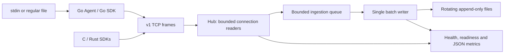

# Architecture

Go is the canonical server and Agent language. C provides an embeddable POSIX
emitter; Rust provides a synchronous standard-library TCP emitter. All clients
share the documented wire format rather than a server implementation.
No third-party runtime dependencies are required.

Each accepted connection has one reader, a payload limit and a read deadline.
A connection map enforces the concurrent limit and allows cancellation to close
all readers. A record transfers ownership to the bounded queue. Full queues block
producers; no worker or queue grows without a configured bound.

One ingestion goroutine accumulates newline-delimited records and writes when
`batch-size` is reached or `flush-interval` ticks. There is no per-record flush.
The first persistence error is retained, readiness becomes false, and subsequent
batches are counted as dropped rather than ambiguously retried. The Hub closes
new connections and stops reading new records when readiness fails. Already
accepted records may still be queued before the failure becomes visible.

Storage serializes writes and rotates before a batch would exceed `rotate-bytes`.
A batch larger than the threshold is kept intact in one file. Archives are `.1`
(newest) through `.N`; retained archives are replaced during rotation. A zero
retention count removes the previous active log. Existing active file size is
measured at startup. Use one Hub per output path; rotation is not multiprocess
safe, crash atomic, compression, or external-rotation aware.

On shutdown the Hub marks itself unready, closes the listener and connections,
waits for readers, closes the queue, waits for its writer to drain, then closes
HTTP and storage. Filesystem writes can block indefinitely on a stalled disk;
there is no unsafe forced cancellation of the persistence goroutine.

The Agent scans stdin or a finite regular file and sends one record at a time.
It retains the current record while reconnecting with capped exponential delays.
Context cancellation interrupts networking and closes input. It does not follow
file growth/rotation or maintain a durable offset. The reusable Go SDK serializes
Send calls; cancel their contexts before calling Close if a send is retrying.
Close releases a connection; a later Send can reconnect.

Metrics use atomic counters; snapshots are individually consistent, not a global
transaction. `records_queued` and `records_batched` are cumulative; `queue_depth`
is a current gauge. `bytes_received` counts Data payload bytes, excluding headers
and appended newlines. `records_dropped` counts decoded records cancelled before
queuing and unsuccessful batches, not malformed or partially received frames.
`batches_written` counts successful writes, `write_failures` failed write attempts.
Health reports HTTP liveness; readiness reports admission/persistence availability.
